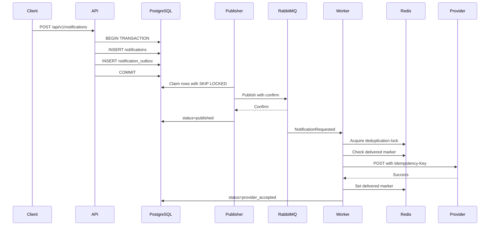
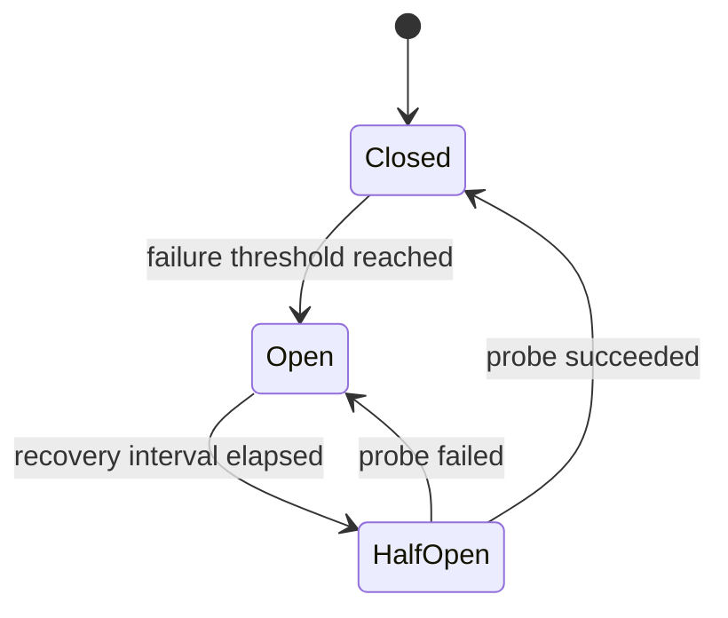

# Notification & Outbox Dispatcher

Production-grade сервис гарантированной доставки уведомлений на PHP 8.3, Symfony 7, PostgreSQL, RabbitMQ и Redis с Transactional Outbox, At-Least-Once delivery, retry/backoff, Dead Letter Queue, Circuit Breaker и дедупликацией.

## Возможности

- ACID-атомарная запись бизнес-сущности и Outbox-события.
- Отдельный Publisher с PostgreSQL `FOR UPDATE SKIP LOCKED`.
- Защита от конкурентной обработки через lease и claim token.
- RabbitMQ publisher confirms.
- Symfony Messenger retry с Exponential Backoff.
- Отдельный RabbitMQ Dead Letter Queue.
- Redis Circuit Breaker в состояниях Closed, Open и Half-Open.
- Атомарная Redis-дедупликация по event ID и channel.
- Distributed lock на время внешнего provider-вызова.
- `Idempotency-Key` для внешнего Email/SMS/Push API.
- Unit-тесты Circuit Breaker и Outbox Publisher.
- Integration test с реальным Redis и имитацией HTTP 503 от provider.
- Docker Compose и GitHub Actions.
- Синтетические данные без production credentials.

## Требования

- Docker Engine 24 или новее.
- Docker Compose v2.
- PHP 8.3 или новее для запуска без Docker.
- PostgreSQL 16.
- RabbitMQ 3.13.
- Redis 7.
- Composer 2.
- Расширения PHP: AMQP, PDO PostgreSQL, Redis, JSON.

## Быстрый запуск

```bash
docker compose up --build -d
```

Проверка состояния:

```bash
curl --fail http://127.0.0.1:8080/health/live
curl --fail http://127.0.0.1:8080/health/ready
```

Создание synthetic notification:

```bash
curl --request POST \
  --header 'Content-Type: application/json' \
  --data '{
    "destinations": {
      "email": "john.doe@example.test"
    },
    "template": "welcome",
    "variables": {
      "firstName": "John"
    }
  }' \
  http://127.0.0.1:8080/api/v1/notifications
```

Пример ответа:

```json
{
  "id": "019430bd-7a10-7000-8000-000000000002",
  "status": "queued"
}
```

RabbitMQ Management UI:

```text
http://127.0.0.1:15672
```

Логин и пароль:

```text
guest
guest
```

Остановка:

```bash
docker compose down
```

Полное удаление локальных данных:

```bash
docker compose down -v
```

## Локальный запуск без Docker

Создайте `.env.local` на основе `.env` и укажите локальные подключения.

Установите зависимости:

```bash
composer install
```

Создайте базу и примените миграции:

```bash
php bin/console doctrine:database:create --if-not-exists
php bin/console doctrine:migrations:migrate --no-interaction
```

Создайте RabbitMQ transports:

```bash
php bin/console messenger:setup-transports
```

Запустите HTTP application:

```bash
php -S 127.0.0.1:8080 -t public public/index.php
```

Запустите Outbox Publisher:

```bash
php bin/console app:outbox:publish --watch --limit=100 --sleep-ms=500
```

Запустите Consumer:

```bash
php bin/console messenger:consume notifications \
  --keepalive=30 \
  --time-limit=3600 \
  --memory-limit=256M
```

## Конфигурация

| Переменная | Назначение |
|---|---|
| `APP_ENV` | Symfony environment |
| `APP_DEBUG` | Debug mode |
| `APP_SECRET` | Symfony application secret |
| `DATABASE_URL` | PostgreSQL DSN |
| `REDIS_URL` | Redis DSN |
| `MESSENGER_TRANSPORT_DSN` | RabbitMQ DSN |
| `PROVIDER_MODE` | `log` или `http` |
| `PROVIDER_EMAIL_URL` | Email provider endpoint |
| `PROVIDER_SMS_URL` | SMS provider endpoint |
| `PROVIDER_PUSH_URL` | Push provider endpoint |
| `PROVIDER_API_KEY` | Bearer token для provider |
| `PROVIDER_HTTP_TIMEOUT` | Timeout внешнего provider-вызова |

По умолчанию используется `PROVIDER_MODE=log`. В этом режиме provider не выполняет сетевой запрос, а записывает synthetic delivery в application log.

Пример HTTP-конфигурации:

```dotenv
PROVIDER_MODE=http
PROVIDER_EMAIL_URL=https://email-provider.example.test/send
PROVIDER_SMS_URL=https://sms-provider.example.test/send
PROVIDER_PUSH_URL=https://push-provider.example.test/send
PROVIDER_API_KEY=synthetic-provider-token
PROVIDER_HTTP_TIMEOUT=5
```

## Архитектура

### Слои

- `Controller` — HTTP endpoints и health checks.
- `Application` — use cases, orchestration, deduplication contracts.
- `Domain` — notification aggregate, domain events и provider contract.
- `Outbox` — Outbox entity, repository, retry strategy и publisher.
- `Messenger` — RabbitMQ message и Consumer Handler.
- `Resilience` — Circuit Breaker.
- `Infrastructure` — Redis, HTTP provider, Doctrine и Messenger.
- `Tests` — Unit и Integration tests.

### Transactional Outbox



`CreateNotificationService` сохраняет Notification и синхронно вызывает domain event. `OutboxNotificationCreatedListener` добавляет Outbox Entity в тот же `EntityManager::wrapInTransaction`. Ошибка listener приводит к rollback бизнес-сущности.

### Claim-модель Outbox

Publisher не удерживает PostgreSQL transaction во время сетевого запроса:

1. Короткая транзакция выбирает строки через `FOR UPDATE SKIP LOCKED`.
2. Строки переводятся в `processing`.
3. Генерируется `lock_token`.
4. Устанавливается `locked_until`.
5. Transaction commit.
6. Publisher отправляет сообщение в RabbitMQ.
7. После broker confirm строка переводится в `published`.

Если процесс завершится после claim, lease истечёт и запись будет повторно доступна.

Если процесс завершится после broker confirm, но до `published`, событие будет опубликовано повторно. Это ожидаемое поведение At-Least-Once.

### Circuit Breaker



Redis хранит:

- `state`;
- количество последовательных failures;
- `open_until`;
- lock единственной half-open probe.

Переходы выполняются Lua-скриптами, поэтому half-open probe не запускается параллельно несколькими workers.

Circuit names изолированы по provider и channel:

```text
http:email
http:sms
http:push
```

Успешный вызов сбрасывает счётчик последовательных ошибок.

### Дедупликация

Дедупликационный key строится из event ID и channel:

```text
notification-outbox:deduplication:<sha256(eventId:channel)>:delivered
```

Алгоритм Consumer:

1. Проверяет `delivered` marker.
2. Получает Redis lock через `SET NX PX`.
3. Повторно проверяет marker после получения lock.
4. Вызывает provider.
5. После успеха атомарно записывает marker и удаляет lock.
6. При ошибке provider освобождает lock и разрешает Messenger retry.

Marker записывается только после успешного ответа provider. Если Redis недоступен, внешний вызов не выполняется, что предотвращает потерю доставки.

## Гарантии доставки

| Сценарий | Результат |
|---|---|
| Crash после записи business entity, но до Outbox commit | Обе записи откатываются одной транзакцией |
| Crash после Outbox commit, до RabbitMQ | Publisher повторит pending event |
| RabbitMQ не подтвердил publish | Outbox остаётся pending и повторяется |
| Crash после RabbitMQ confirm, до `published` | Сообщение публикуется повторно |
| Повторная доставка Consumer | Redis marker предотвращает повторный provider call |
| Provider вернул ошибку | Messenger повторяет сообщение с backoff |
| Исчерпаны Messenger retries | Сообщение попадает в `notifications_dlq` |
| Provider mass outage | Circuit Breaker перестаёт вызывать provider |
| Crash после provider success, до Redis marker | Возможна повторная внешняя доставка |

Exactly Once delivery во внешний API невозможна без поддержки idempotency на стороне provider. Проект обеспечивает At-Least-Once processing и снижает количество внешних дублей через Redis.

## Retry и DLQ

### Publisher

Параметры задаются в `config/services.yaml`:

- `outbox.max_attempts=10`;
- `outbox.base_delay_ms=1000`;
- `outbox.multiplier=2`;
- `outbox.max_delay_ms=300000`;
- `outbox.jitter=0.2`.

Алгоритм:

```text
delay = min(maxDelay, baseDelay × multiplier^(attempt - 1))
delay = delay + random jitter
```

Исчерпавшие попытки записи переводятся в `dead`.

### Consumer

Параметры задаются в `config/packages/messenger.yaml`:

- initial delay: 1 second;
- multiplier: 2;
- maximum delay: 64 seconds;
- maximum retries: 5.

После исчерпания retries Symfony Messenger отправляет сообщение в `failed` transport. В этом проекте transport представлен RabbitMQ queue `notifications_dlq`.

## Эксплуатация DLQ

Показать failed messages:

```bash
docker compose exec app php bin/console messenger:failed:show
```

Повторить одно сообщение:

```bash
docker compose exec app php bin/console messenger:failed:retry --force <message-id>
```

Повторить все сообщения:

```bash
docker compose exec app php bin/console messenger:failed:retry --force
```

Удалить failed messages:

```bash
docker compose exec app php bin/console messenger:failed:remove --force
```

## Тесты

Unit tests не требуют внешних сервисов:

```bash
composer test
```

Integration test требует Redis:

```bash
composer test:integration
```

Все тесты:

```bash
composer test:all
```

PHP syntax validation:

```bash
composer lint:php
```

Тесты проверяют:

- открытие Circuit Breaker после failure threshold;
- блокировку внешнего provider call в Open;
- half-open probe;
- reset failure counter после success;
- публикацию claimed Outbox event;
- scheduling retry;
- переход в dead state;
- provider HTTP 503;
- использование реального Redis Circuit State Store;
- использование реального Redis delivery deduplication;
- отсутствие третьего HTTP-вызова после открытия circuit.

## CI

Workflow находится в `.github/workflows/ci.yml`.

Он выполняет:

1. Composer manifest validation.
2. Установку зависимостей.
3. PHP syntax validation.
4. Unit tests.
5. Integration tests с Redis.
6. Composer security audit.
7. Docker Compose validation.
8. Docker image build.
9. Docker Compose smoke test.
10. Создание synthetic notification через HTTP API.

## База данных

Основные таблицы:

### `notifications`

- `id`;
- `destinations`;
- `template`;
- `variables`;
- `status`;
- `created_at`;
- `updated_at`.

### `notification_outbox`

- `id`;
- `aggregate_type`;
- `aggregate_id`;
- `event_type`;
- `payload`;
- `occurred_at`;
- `available_at`;
- `status`;
- `attempts`;
- `locked_until`;
- `lock_token`;
- `published_at`;
- `last_error`;
- `updated_at`.

Статусы Outbox:

- `pending`;
- `processing`;
- `published`;
- `dead`.

## Retention

Published Outbox records можно удалять отдельным maintenance job после максимального срока аудита и повторной доставки:

```sql
DELETE FROM notification_outbox
WHERE status = 'published'
  AND published_at < NOW() - INTERVAL '30 days';
```

Cleanup должен выполняться отдельным DBA-approved процессом и не использоваться вместо архивирования, необходимого для аудита.

## Наблюдаемость

Все процессы пишут structured context в stderr:

- event ID;
- notification ID;
- outbox ID;
- claim token;
- channel;
- attempt;
- next attempt time;
- exception.

Рекомендуемые production metrics:

- `outbox_pending_events`;
- `outbox_oldest_pending_age_seconds`;
- `outbox_dead_events_total`;
- `messenger_retry_total`;
- `messenger_dlq_messages`;
- `provider_requests_total{provider,channel,result}`;
- `circuit_state{provider,channel}`;
- `deduplication_hits_total`;
- `notification_delivery_duration_seconds`.

Рекомендуемые alerts:

- Outbox oldest pending age выше допустимого SLA.
- Рост `dead`.
- Любое появление DLQ messages.
- Circuit Open дольше recovery interval.
- Рост provider failure rate.
- Redis unavailable.
- RabbitMQ queue depth выше допустимого.

## Security considerations

Проект демонстрирует backend architecture, поэтому authentication и authorization намеренно оставлены за API Gateway.

Перед production использованием необходимо добавить:

- OAuth2/OIDC authentication;
- authorization policy для создания уведомлений;
- rate limiting;
- request size limits;
- TLS для PostgreSQL, RabbitMQ и Redis;
- secrets manager;
- provider-specific data minimization;
- audit log;
- запрет персональных данных в application logs;
- rotation `Idempotency-Key` retention strategy.

Provider credentials не хранятся в репозитории.

## Ограничения

- Delivery является At-Least-Once, а не Exactly Once.
- Если provider успешно отправил уведомление, но worker crash до Redis marker, возможен повтор.
- Внешний provider должен поддерживать `Idempotency-Key` для полноценной идемпотентности.
- Redis должен быть настроен с persistence и высокой доступностью.
- RabbitMQ и Redis не должны использовать `noeviction` для критичных broker queues; локальная Redis-конфигурация использует его только для защиты от silent eviction.
- В production необходимы observability, alerting, retention и backup policies.
